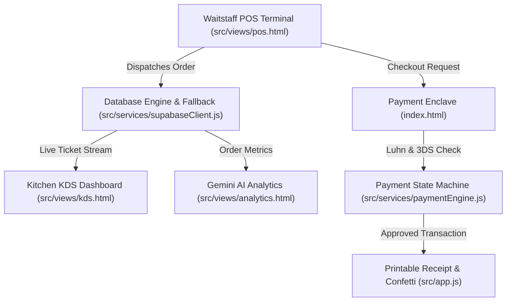

# 🍳 RestaurantOS — Enterprise Restaurant Operating System & Risk-Free Payment Enclave

> **Built with ❤️ by Team HexCore for Hackathons & Next-Gen Hospitality Tech**

[](https://vercel.com)
[](LICENSE)
[](https://developer.mozilla.org/en-US/docs/Web/JavaScript)
[](https://ai.google.dev)
[](https://supabase.com)

---

## 💡 What is RestaurantOS?

**RestaurantOS** is an ultra-fast, zero-overhead, full-stack Restaurant Operating System designed to bridge table ordering, point-of-sale management, kitchen operations, and checkout security into a single cohesive web application.

Built without heavy bloated frameworks, RestaurantOS runs on pure, modern **HTML5, Vanilla ES6+ JavaScript, and Custom CSS3 Design Tokens**. It features an interactive **3D Credit Card Payment Visualizer**, **Real-time Kitchen Display System (KDS)**, **POS Order Dispatcher**, and **Google Gemini AI Menu Pairing Intelligence**.

---

## ✨ Core Features & Modules

### 1. 💳 Risk-Free Payment Gateway Enclave
* **Interactive 3D Card Visualizer**: Card automatically flips 180° when focusing on the CVV input field.
* **Auto Card Brand Detection**: Real-time identification of Visa, Mastercard, Amex, and Discover card prefixes.
* **Luhn Algorithm Checksum**: Validates card numbers locally before submitting payload.
* **Simulated 3D Secure OTP Challenge**: Realistic 2-Factor authentication modal (Passcode: `123456`).
* **Instant Printable Receipt**: Generates unique transaction IDs (`REST-TXN-84920491-TEST`), printable layout, and celebration confetti.
* **Sandbox Test Presets**: 1-click test buttons for **Success**, **3DS OTP Challenge**, and **Decline** scenarios.

### 2. 🖥️ Point-of-Sale (POS) Order Terminal
* **Table Selector Sync**: Assign orders to specific dining tables (Table 01 to Table 06).
* **Category Pill Navigation**: Instant filtering across Starters, Mains & Steaks, Cocktails, and Desserts.
* **Live Order Cart**: Real-time subtotal, 8.5% tax calculations, and quantity adjustments.
* **Kitchen Order Dispatcher**: Sends active tickets directly to the Kitchen KDS with a single click.

### 3. 👨‍🍳 Kitchen Display System (KDS)
* **Real-time Order Polling**: Kitchen chefs receive live tickets without page reloads.
* **Color-Coded Status Badges**: `NEW` (Amber), `PREPARING` (Blue), and `READY` (Green).
* **1-Click Ticket Progression**: Chefs update ticket states from cooking to served in real time.

### 4. 🧠 Gemini AI Menu Intelligence & Analytics
* **AI Beverage & Side Pairings**: Suggests complementary drinks and sides based on flavor profiles (e.g., Wagyu Sliders paired with Smoked Old Fashioned).
* **Executive Sales Analytics**: Displays daily gross revenue, check averages, and payment approval metrics.
* **Smart Revenue Tips**: Gemini AI analyzes peak dining hours and suggests promotional menu bundles.

---

## 🏗️ System Architecture & Workflow



---

## 📂 Project Directory Structure

```
RestaurantOS/
├── .env.example                # Environment configuration template
├── .gitignore                  # Git exclusion rules for node_modules & secrets
├── index.html                  # Payment Gateway Enclave & Card Visualizer UI
├── package.json                # Project manifest & npm scripts
├── README.md                   # Hackathon Documentation
└── src/
    ├── app.js                  # Main Application Controller & Event Listeners
    ├── controllers/
    │   ├── kdsController.js    # Kitchen KDS Ticket Polling & Status Progression
    │   └── posController.js    # POS Cart Management & Order Dispatcher
    ├── db/
    │   └── schema.sql          # PostgreSQL / Supabase Relational Database Schema & RLS
    ├── services/
    │   ├── geminiService.js    # Gemini AI Pairing & Sales Analytics Service
    │   ├── menuService.js      # Menu Filtering, Search & Tax Calculations
    │   ├── paymentEngine.js    # Payment Processing State Machine & 3DS OTP
    │   └── supabaseClient.js   # Database Connection Client & In-Memory Fallback
    ├── styles/
    │   ├── components.css      # 3D Card, Modals & Component Stylesheet
    │   ├── pos.css             # POS Grid, Food Cards & Cart Sidebar Stylesheet
    │   └── tokens.css          # Design System CSS Variables & Theme Palette
    └── views/
        ├── analytics.html      # Executive Sales Analytics & AI Insights View
        ├── kds.html            # Kitchen Display System View for Chefs
        └── pos.html            # Waitstaff POS Terminal View
```

---

## ⚡ Quickstart & Local Setup

### 1. Clone & Navigate
```bash
git clone https://github.com/amritanshushaw-cpu/RestaurantOS.git
cd RestaurantOS
```

### 2. Run Local Development Server
```bash
npm run dev
```
Open **`http://localhost:3000`** in your browser!

---

## 🌐 Production Deployment

This project is optimized for 1-click deployment on **Vercel**:

1. Import `amritanshushaw-cpu/RestaurantOS` into [Vercel](https://vercel.com/new).
2. Click **Deploy**.
3. Live production link will be generated automatically in ~10 seconds!

---

## 👥 Developed by Team HexCore

| Name | Role |
|---|---|
| **Saptak Sarathi Chakroborty** | Full-Stack Architect & Backend Engine |
| **Shrinivas Ghosh** | System Design & Database Infrastructure |
| **Amritanshu Shaw** | UI/UX Systems & Payment Enclave Specialist |
| **Ritam Karmakar** | Frontend Engineering & KDS Workflow |

---

*Made with pride by Team HexCore.* 🚀